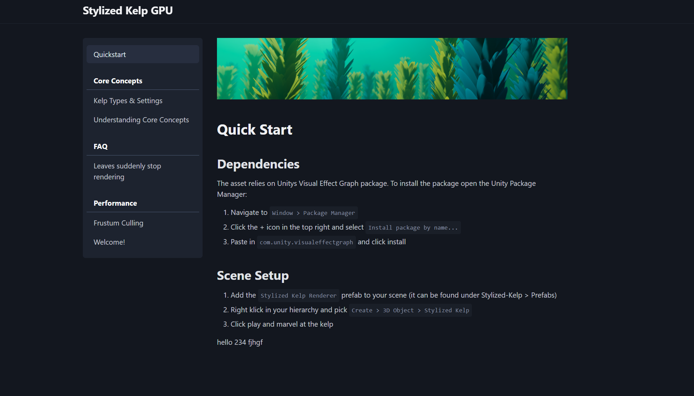

# Offline-Docs
A simple Node.js package that you can use to create offline product documentation using Markdown. The tool embeds all content into a single output file.



[](https://github.com/Kellojo/Offline-Docs/actions/workflows/github-code-scanning/codeql)

## Features:
- Embedds images as base64
- Embedds your md files
- Yields a singular .html file as it's output, that is ready for offline use
- Syntax highlighting

## Quickstart
1. Create a new folder and add a config.yaml to it with the following content:
```yaml
title: My Documentation Title
theme: cyan
```
2. Start creating new markdown files in that folder to get your documentation going
3. Run `npx ...` to open the live preview of your documentation
4. Once happy, run `npx offline-md-docs build` to build your final html file

## Running a loal dev server
To run a local dev server, which shows you a live preview of your docs, run:
```
npx offline-md-docs start
```

## Building the docs
To build your documentation, run:
```
npx offline-md-docs build
```

## Theming
The builder uses [Pico CSS](https://picocss.com/) under the hood, which allows you to customize the color by providing a predefined scheme, that pico provides.
You can find an overview over all available color schemes here: https://picocss.com/docs/version-picker

## Custom Sort Order
Entries (either folders or md files) can have a custom order assigned as follows:

**Markdown Files**
Put this yaml metadata at the top of your file:
```yaml
---
order: 1
---
```

**Folder Customization**
Add a metadata.yaml file to your folder, which contains the metadata:
```yaml
---
order: 1
---
```

## Roadmap
- Linking between different headings across pages
- Improved image embedding (only embedd images once)
- Support infinite nesting (currently only supports folders on the root level
- Support phones and make the pages more responsive
- Live reload on file change for the local dev server
