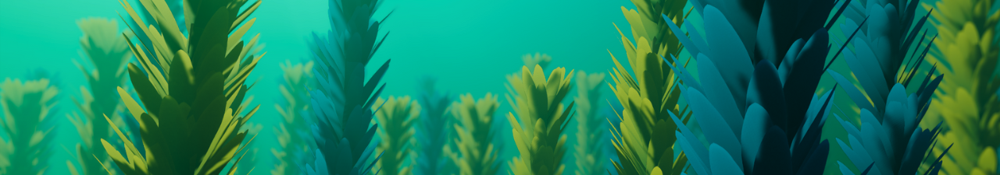

```yaml
- Color Mode
- Leaf Color    
- Leaf Size
```

```js
const a = 2; console.log(a);
```

```csharp
using System;
using System.Collections;
using System.Collections.Generic;
using Kellojo.StylizedKelp;
using UnityEngine;
using UnityEngine.Serialization;

public class KelpSpatialPartitioner : MonoBehaviour {

    [FormerlySerializedAs("Player")] public Transform player;
    private List<StylizedKelpRenderer> _kelpRenderers = new List<StylizedKelpRenderer>();
    
    private void Awake() {
        _kelpRenderers.AddRange(FindObjectsByType<StylizedKelpRenderer>(FindObjectsSortMode.None));
        
        var mainCamera = Camera.main;
        if (mainCamera != null && player == null) player = mainCamera.transform;
    }

    private void OnEnable() {
        StartCoroutine(RunPartitioner());
    }

    IEnumerator RunPartitioner() {
        while (enabled) {
            yield return new WaitForSeconds(0.5f);
            
            foreach (var kelpRenderer in _kelpRenderers) {
                var distance = Vector3.Distance(kelpRenderer.transform.position, player.position);
                kelpRenderer.enabled = distance < kelpRenderer.simulationDistance;
            }
        }
    }
    
}
```